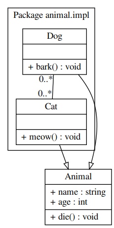
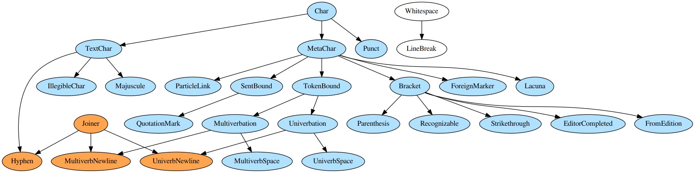

# `coraxml_utils`

`coraxml_utils` is a collection of tools for processing CorA-XML and the various associated transcription languages for historical manuscripts.

It consists of:

- A model for CorA-XML
- A model for transcriptions
- Importers to read different file formats and 
- Exporters to dump the content of a data model to certain formats 
- Scripts for carrying out various combinations of these tasks.

# The data model

## Corpus documents

A CorA-XML file is represented in our data model by the `Document` object. The internal structure of `Document` objects reflects the fact that they are meant to represent historical prints and manuscripts. They thus also model the layout of text on pages. 

## Transcriptions

A transcription (`Trans`) consists of characters (`Char`) -- see the next section for more on characters. 

The central distinction that CorA-XML makes is that between *diplomatic* tokenizations and *modernized*, i.e. *annotatable*, tokenizations. CorA-XML additionally differentiates between *diplomatic* representations of transcribed text and *simplified* ASCII representations of the same text.

A `Trans` object thus has two essential methods: `tokenize_dipl` and `tokenize_anno` for producing the two tokenizations. The `tokenize_dipl` method produces a list of `DiplTrans` objects, which contain the UTF diplomatic representation of the transcriptions (accessible with `.utf()`). The `tokenize_anno` produces a list of `AnnoTrans` objects that contain the simplified ASCII representations (`.simple()`).

## Character classes

For the processing of transcriptions, `coraxml_utils` makes use of a detailed character class model.

Visualization of character class hierarchy:

# Scripts

- trans2coraxml.py
- coraxml2gatejson.py

# Parsers

Currently there are parsers for the following transcription conventions.

## `RexParser`

This parser should cover all of the features of the transcription languages for ReF, ReDi, and Anselm, as well as a few other of the related projects (maybe).

## `RemParser`

Due to a few special features of the REM transcriptions, we have also implemented a parser for REM in particular.

# Importers

## `CoraXMLImporter`

## `TransImporter`

For plain text transcription files.

## `BonnXMLImporter`

For REM.

# Exporters

## `CoraXMLExporter`

Data imported with the `CoraXMLImporter` and exported with this exporter should be identical.

## `TransExporter`

## `TEIExporter`

## `GateJsonExporter`

This is the variant of Tweet JSON used by GATE.

# Modifiers

Modifiers are functions that perform whatever post-processing one might require in certain situations.

## Adding tokenization tags

For REF, Anselm, and REM (at least) we want to have tags indicating where univerbation or multiverbation has taken place. The `add_tokenization_tags` function adds these tags based on the `TokenBound` annotations added during the transcription phase.

## Modifying tags

The `add_punc_tags` converts sentence boundary annotations to tags that are easier to query (?)

# TODO

* Zweifelhafter Simplifizierungsregeln (möglicherweise müssen diese projektspezifisch
aufgefasst werden)
	* I005: `<mod id="a3220" trans="au\-$z*1|" utf="aūſz" simple="aunsz"/>`
	* I015: `<mod id="a42" trans="rote\-b\:g" utf="rotēb̈g" simple="rotenbg"/>`
* Validierung
	* Präeditionszeichen sind alleinstehend als Token nicht erlaubt
* Extended CorA-XML: extends CorA-XML, adding span annotations and subtoken annotations

