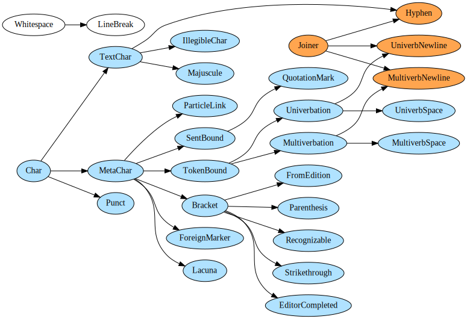

# CorA-XML Utils
](https://img.shields.io/badge/License-GPLv3-blue.svg)
](coverage.svg)
](https://img.shields.io/badge/code%20style-black-000000.svg)

CorA-XML Utils is a collection of tools for processing CorA-XML and the various associated transcription languages for historical manuscripts.

It consists of:

- A model for CorA-XML
- A model for transcriptions
- Importers to read different file formats and 
- Exporters to dump the content of a data model to certain formats 
- Scripts for carrying out various combinations of these tasks.

# Installation

Dependencies:
* `regex`
* `lxml`
* `nose2`
* `click`

These should be installed automatically by the setup script:
```
python3 setup.py install --user
```
(NB: Your Python 3 executable might just be called `python`.)


# Running tests

From the `test/` directory (optionally calculating test coverage):
```
nose2 [--with-coverage --coverage coraxml_utils]
```


# The data model


## Corpus documents

A CorA-XML file is represented in our data model by the `Document` object. The internal structure of `Document` objects reflects the fact that they are meant to represent historical prints and manuscripts. They thus also model the layout of text on pages. 

A `Document` thus consists of `Page`s which then are made up of `Column`s which contain a series of `Line`s. Each line contains a series of diplomatic transcriptions (`TokDipl`). Parallel to these structures, the `Document`s contains the list of `CoraToken`s, which represent the mapping between the diplomatically faithful tokenizations and the modernized, annotatable tokenizations. Each `CoraToken` object contains a series of `TokDipl` and `TokAnno` objects, and the `TokAnno` objects contain all of the annotations visible/editable on CorA.

## Transcriptions

A transcription (`Trans`) consists of characters (`Char`) -- see the next section for more on characters. 

The central distinction that CorA-XML makes is that between *diplomatic* tokenizations and *modernized*, i.e. *annotatable*, tokenizations. CorA-XML additionally differentiates between *diplomatic* representations of transcribed text and *simplified* ASCII representations of the same text.

A `Trans` object thus has two essential methods: `tokenize_dipl` and `tokenize_anno` for producing the two tokenizations. The `tokenize_dipl` method produces a list of `DiplTrans` objects, which contain the UTF diplomatic representation of the transcriptions (accessible with `.utf()`). The `tokenize_anno` produces a list of `AnnoTrans` objects that contain the simplified ASCII representations (`.simple()`).


## Character classes

For the processing of transcriptions, `coraxml_utils` makes use of a detailed character class model.

Visualization of character class hierarchy:



# Scripts

Contents of the `bin/` directory.

## Interacting with CorA

For scripting some of the basic functions of [CorA](http://github.com/comphist/cora) there is `corascript.py`.

## Conversion Scripts

Scripts used for converting between formats follow the naming convention `{source}2{destination}.py`. Some examples:

- trans2coraxml.py
- coraxml2gatejson.py
- coraxml2tei.py
- (etc.)

## Applying Transformations to a Corpus

It may seem surprising that there is a script for converting from *and* to
CorA-XML: `coraxml2coraxml.py`. This script is intended to assist in the
application of various custom transformations to the data and to confirm that
the data are valid and correctly processed.

# Available Transcription Parsers

Currently there are parsers for the following transcription conventions.

* ReM ([Referenzkorpus Mittelhochdeutsch](https://linguistics.rub.de/rem))
* ReF ([Referenzkorpus Frühneuhochdeutsch](https://linguistics.rub.de/ref))
* ReDI ([Referenzkorpus Deutscher Inschriften](https://www.ruhr-uni-bochum.de/wegera/ReDI/index.htm))
* Anselm ([The Anselm Corpus](https://linguistics.rub.de/anselm))
* ReN ([Referenzkorpus Mittelniederdeutsch/Niederrheinisch (1200&ndash;1650)](https://www.slm.uni-hamburg.de/ren.html))


# Importers

* `CoraXMLImporter`
* `TransImporter` (For plain text transcription files.)
* `BonnXMLImporter` (For ReM.)


# Exporters

*`CoraXMLExporter`
    * Data imported with the `CoraXMLImporter` and exported with this exporter should be identical.
* `TransExporter` 
* `TEIExporter`
* `GateJsonExporter` (This is the variant of Tweet JSON used by GATE.)
* `MarkdownExporter`


# Modifiers

Sometimes you want to transform a document in some way before exporting it to a destination format: rename a node, add some tags, etc. For this, CorA-XML Utils uses **modifiers**: functions that perform whatever post-processing one might require in certain situations.

The following are some of the modifiers currently included in CorA-XML Utils.

## Adding tokenization tags

For ReF, Anselm, and ReM (at least) we want to have tags indicating where
univerbation or multiverbation has taken place. The `add_tokenization_tags`
function adds these tags based on the `TokenBound` annotations added during the
transcription phase.

## Modifying tags

The `add_punc_tags` function converts sentence boundary annotations (such as
`(.)` or `(?)`) to tags that are easier to query.


